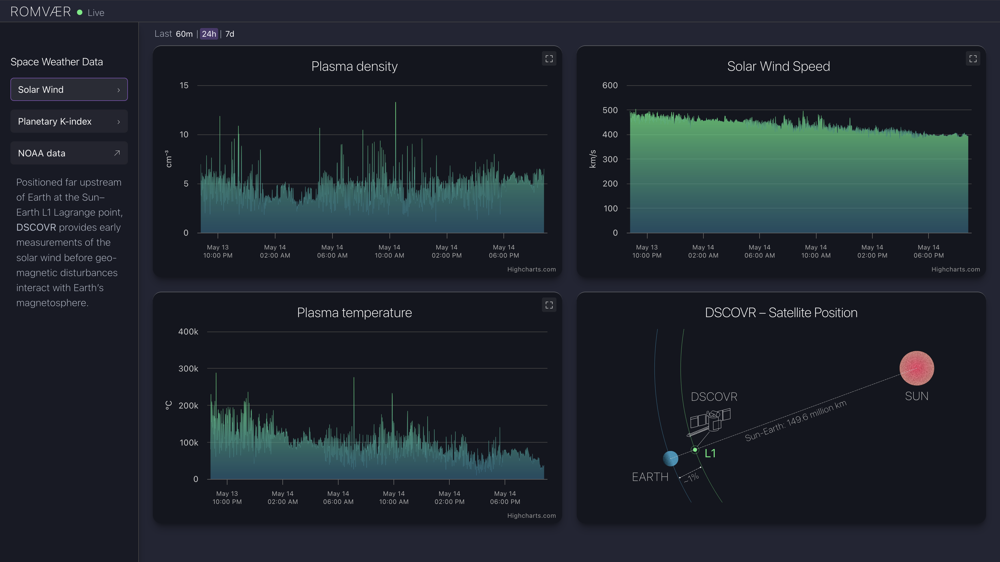
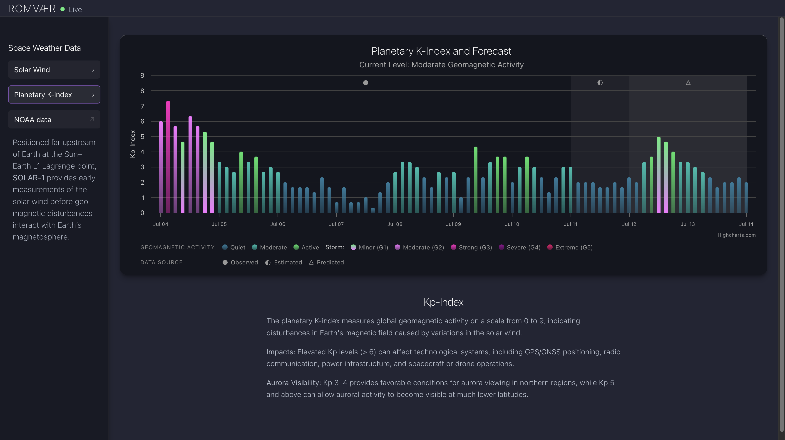
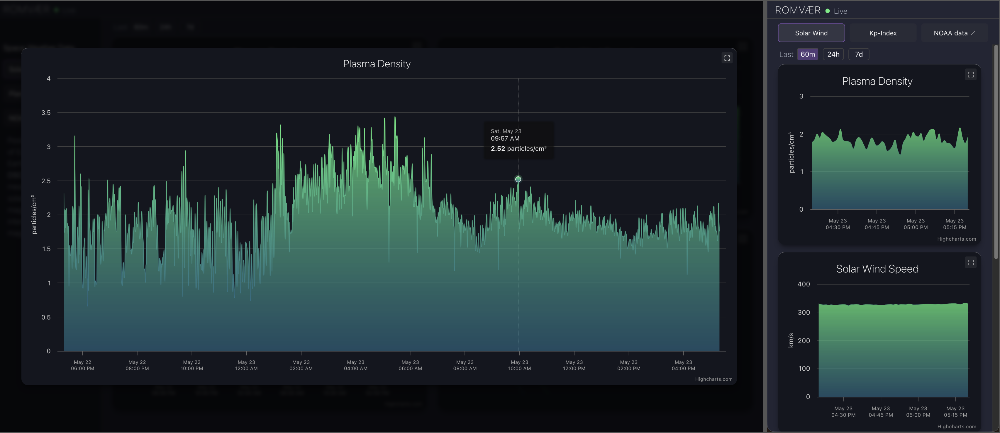

# Romvær

A responsive space weather dashboard for visualizing real-time solar wind conditions, geomagnetic activity, and aurora visibility using live NOAA SWPC data.
This dashboard is designed for enthusiasts interested in space weather and aurora observation.
Built with React, TypeScript, Vite, and Highcharts.

---

## 💡 Motivation

I built Romvær to explore modern frontend development and scientific data visualization using React and Highcharts.

The project combines my interests in space weather, data visualization, interactive monitoring systems, and responsive UI design while working with real-time NOAA data streams.

--- 

## ✨ Features

- real-time solar wind data visualization
- planetary K-index forecast and storm levels
- aurora visibility guidance
- responsive desktop/mobile layout
- interactive Highcharts with tooltips and overlays
- client-side time range filtering
- custom geomagnetic storm classification system
- NOAA SWPC data integration

---

## 📸 Preview

### Solar Wind Monitoring Dashboard



### Planetary K-index Forecast



### Modular & Mobile View



---
## 🚀 Live Demo

View project: [romvaer.vercel.app](https://romvaer.vercel.app/)
- Live deployment with automatic updates via Vercel
- Real-time NOAA SWPC data integration
---

## 🛰 Data Sources

This project uses public data provided by NOAA Space Weather Prediction Center (SWPC).

Link: [NOAA SWPC data](https://services.swpc.noaa.gov/products/)

---

## 🛠 Tech Stack

- React
- TypeScript
- Vite
- Highcharts
- CSS3, HTML5
- NOAA SWPC API

---

## 📂 Project Structure

- `components/` – reusable chart and UI components
- `config/` – dashboard and chart configuration
- `utils/` – geomagnetic storm utilities and helpers
- `assets/` – static visual assets

---

## ⚙️ Local Development

Clone the repository:

```bash
git clone https://github.com/bbdataviz/Romvaer.git
```

Install dependencies:

```bash
npm install
```

Run development server:

```bash
npm run dev
```

Build production version:

```bash
npm run build
```

---

## 📱 Responsiveness

The dashboard is designed for both desktop and mobile layouts using CSS Grid, Flexbox, and responsive breakpoints.
The desktop layout provides the most complete monitoring experience, while the mobile layout focuses on compact navigation and readability.

---

## 🎨 Design Notes

The UI was inspired by:
- modern monitoring dashboards
- atmospheric aurora color palettes
- scientific visualization interfaces

The project focuses on balancing:
- data density
- readability
- responsive interaction
- visual hierarchy

---

## 🧠 What I Learned

This project gave me practical experience with:

- working with real-time NOAA SWPC API data
- transforming scientific datasets for frontend visualization
- structuring reusable React and TypeScript components
- configuring interactive Highcharts visualizations
- balancing scientific accuracy with readability and usability
- iterative UI refinement for dense data interfaces

--- 

## 🔭 Future Improvements

- anomaly detection in solar wind data
- real-time DSCOVR satellite position visualization
- historical geomagnetic activity views (event visualization)
- expanded aurora forecast tools
- improved accessibility, e.g., informational overlays and keyboard navigation

---

## 📄 License

This project is licensed under the MIT License.
Copyright (c) 2026 Beatrice Budich
