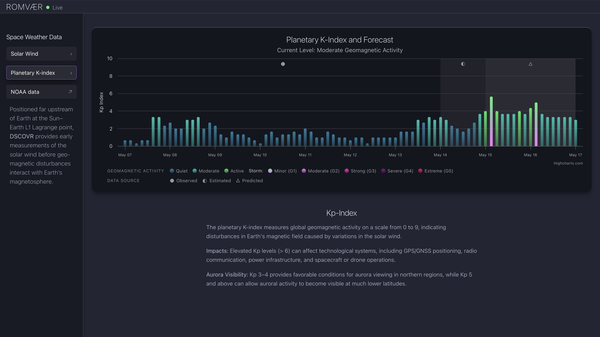

# Romvær

A responsive space weather dashboard for visualizing real-time solar wind conditions and geomagnetic activity.

Built with React, TypeScript, Vite, and Highcharts using live NOAA SWPC data.

---

## ✨ Features

- Real-time solar wind data visualization
- Planetary K-index forecast and storm levels
- Aurora visibility guidance
- Responsive desktop/mobile layout
- Interactive Highcharts with tooltips and overlays
- Custom geomagnetic storm classification system
- NOAA SWPC data integration

---

## 📸 Preview

### Solar Wind Dashboard


### Planetary K-index



### Modular & Mobile View


---
## 🚀 Live Demo

View project: https://romvaer.vercel.app/
---

## 🛰 Data Sources

This project uses public data provided by NOAA Space Weather Prediction Center (SWPC).

Link: https://services.swpc.noaa.gov/products/

---

## 🛠 Tech Stack

- React
- TypeScript
- Vite
- Highcharts
- CSS3, HTML
- NOAA SWPC API

---

## ⚙️ Local Development

Clone the repository:

```bash
git clone https://github.com/bbdataviz/Romvaer.git
```

Install dependencies:

```bash
npm install
```

Run development server:

```bash
npm run dev
```

Build production version:

```bash
npm run build
```

---

## 📱 Responsiveness

The dashboard is designed for both desktop and mobile layouts using CSS Grid, Flexbox, and responsive breakpoints.
If possible, I recommend using the desktop version.


---

## 🎨 Design Notes

The UI was inspired by:
- modern monitoring dashboards
- atmospheric aurora color palettes
- scientific visualization interfaces

The project focuses on balancing:
- data density
- readability
- responsive interaction
- visual hierarchy

---

## 🔭 Future Improvements

- Anomaly detetction in solar wind data
- Real-time DSCOVR satellite position visualization
- Historical geomagnetic activity views
- Expanded aurora forecast tools
- Improved accessibility, e.g., informational overlays and keyboard navigation

---

## 📄 License


Copyright (c) 2026 Beatrice Budich

Permission is hereby granted, free of charge, to any person obtaining a copy
of this software and associated documentation files (the "Software"), to deal
in the Software without restriction, including without limitation the rights
to use, copy, modify, merge, publish, distribute, sublicense, and/or sell
copies of the Software, and to permit persons to whom the Software is
furnished to do so, subject to the following conditions:

The above copyright notice and this permission notice shall be included in all
copies or substantial portions of the Software.

THE SOFTWARE IS PROVIDED "AS IS", WITHOUT WARRANTY OF ANY KIND, EXPRESS OR
IMPLIED, INCLUDING BUT NOT LIMITED TO THE WARRANTIES OF MERCHANTABILITY,
FITNESS FOR A PARTICULAR PURPOSE AND NONINFRINGEMENT. IN NO EVENT SHALL THE
AUTHORS OR COPYRIGHT HOLDERS BE LIABLE FOR ANY CLAIM, DAMAGES OR OTHER
LIABILITY, WHETHER IN AN ACTION OF CONTRACT, TORT OR OTHERWISE, ARISING FROM,
OUT OF OR IN CONNECTION WITH THE SOFTWARE OR THE USE OR OTHER DEALINGS IN THE
SOFTWARE.
